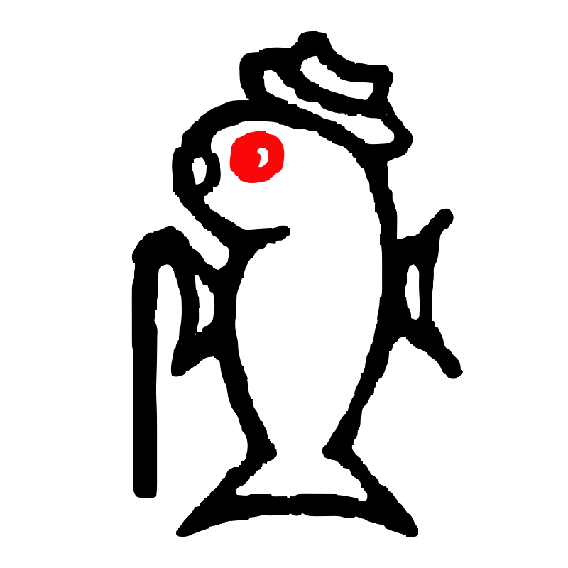

<p align="center">
  <a href="https://github.com/lotolab" target="blank"></a>
</p>

<p align="center">A progressive <a href="http://nodejs.org" target="blank">Node.js</a> framework for building efficient and scalable server-side applications.</p>


## Description

 The Tsai CLI is extends from nestjs schematics.
 It is a command-line interface tool that helps you to initialize, develop, and maintain your Nest applications. It assists in multiple ways, including scaffolding the project, serving it in development mode, and building and bundling the application for production distribution. It embodies best-practice architectural patterns to encourage well-structured apps. Read more [here](https://docs.nestjs.com/cli/overview).

## Installation

```bash
$ npm install -g @nestjs/schematics
```

## Usage

Learn more in the [official documentation](https://docs.nestjs.com/).

## Stay in touch

- Website - [https://nestjs.com](https://nestjs.com/)
- Twitter - [@nestframework](https://twitter.com/nestframework)

## License

Nest is [MIT licensed](LICENSE).